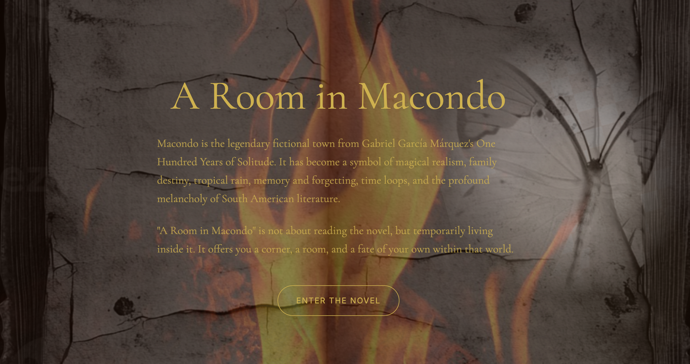
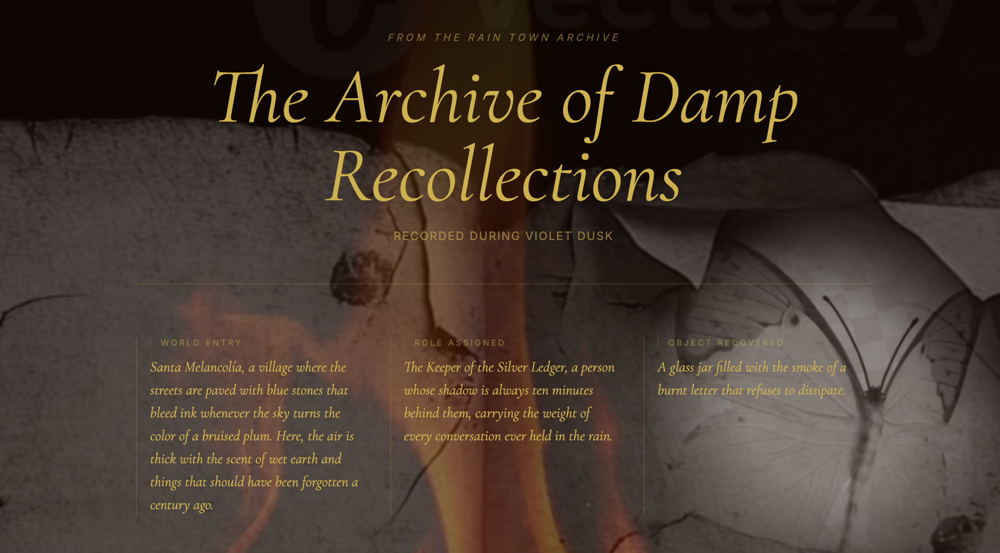

<div align="center">
  
</div>

<br />

<div align="center">
  <h1>✦ A Room in Macondo ✦</h1>
  <p><em>An atmospheric AI literary experience<br/>inspired by One Hundred Years of Solitude</em></p>
  <br/>
  <a href="https://a-room-in-macondo.vercel.app/">
    
  </a>
  &nbsp;
  
  &nbsp;
  
</div>

<br />


<br />

> *"It's enough for me to be sure that you and I exist at this moment."*
> — Gabriel García Márquez

<br />

## ❧ What Is This

**A Room in Macondo** is not a summary of the novel. It is not a quiz. It is not a chatbot about García Márquez.

It is a **literary portal** — a small, moody AI experience that asks you four ritual questions, then generates a dreamlike narrative fragment written as though it drifted out of Macondo itself.

You enter with your haunting. You leave with a story that was written for you.

<br />

## ❧ The Ritual

The experience moves through four atmospheric prompts:

| Prompt | What It Asks |
|--------|--------------|
| 🕯️ **The Haunting** | What has been following you lately? |
| 🌧️ **The Weather** | What weather do you wish to step into? |
| 📖 **The Story** | What kind of story can hold you tonight? |
| 🪞 **The Trust** | What do you trust more — memory, or something else? |

These answers become the mood ingredients the AI uses to generate your personal **story archive** — a paragraph that feels fragile, strange, and half-remembered.

<br />

## ❧ Screenshots

<div align="center">

### Landing Page


<br/>

### The Ritual


<br/>

### Your Story Archive


</div>

<br />

## ❧ Design Language

The visual world of the project was built around a single question: *what does Macondo look like if you can almost touch it?*

```
burning paper          →   warm candlelight palette
cracked plaster walls  →   archival, worn textures
yellow butterflies     →   recurring motif in the UI
gold serif typography  →   weight of memory and time
tropical ruin          →   entropy as beauty
```

The goal was to make something that feels less like opening an app and more like **opening an old room in a novel that has been waiting for you**.

<br />

## ❧ Tech Stack

```
Frontend    →   Next.js + TypeScript + Tailwind CSS
AI          →   Gemini API
Deploy      →   Vercel
```

<br />

## ❧ Run Locally

```bash
# 1. Clone the repository
git clone https://github.com/your-username/a-room-in-macondo.git
cd a-room-in-macondo

# 2. Install dependencies
npm install

# 3. Add your API key
echo "GEMINI_API_KEY=your_api_key_here" > .env.local

# 4. Start the dev server
npm run dev
```

Then open [http://localhost:3000](http://localhost:3000) and enter.

<br />


<br />

<div align="center">
  <p><sub>
    This is a creative, AI-generated literary experience inspired by the atmosphere of <em>One Hundred Years of Solitude</em>.<br/>
    It is not affiliated with or endorsed by the original rights holders.<br/>
    Intended as an interpretive artistic experiment — not a substitute for the novel.
  </sub></p>
  <br/>
  <sub>MIT License &nbsp;·&nbsp; Made with literary melancholy</sub>
</div>
